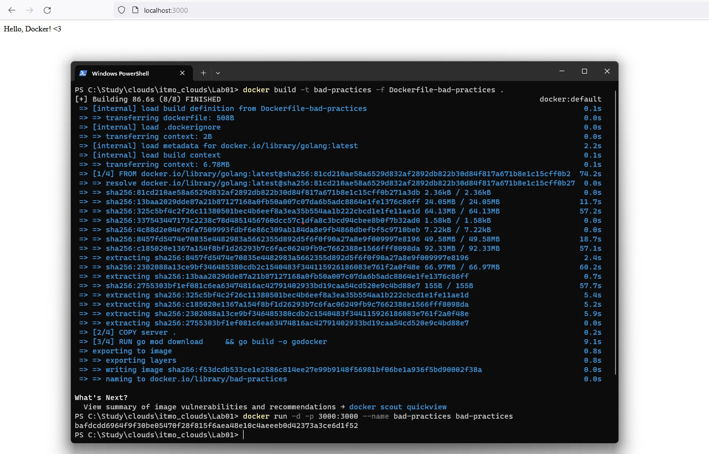
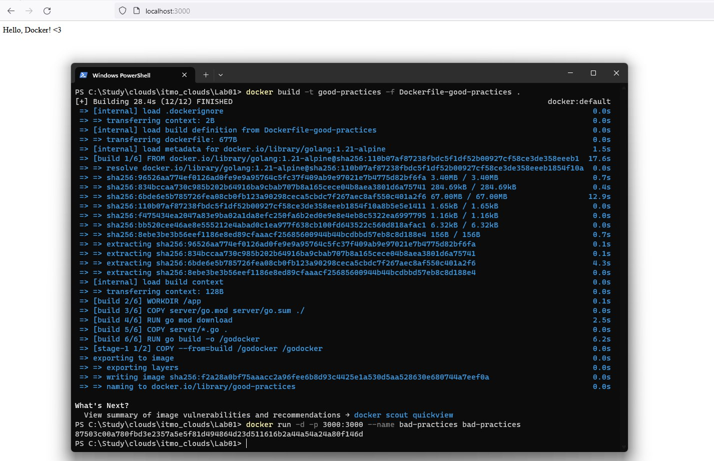
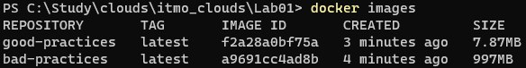

# Лабораторная работа №* "Работа с Dockerfile"

## Выполнили: 
Бевз Тимофей K34201, Загайнова Кристина K34201, Блохина Анастасия K34201, Балашов Матвей K34201

## Цель работы:
Создание приложения, которое в запущенном контейнере записывает изменения в базу данных.

## Задачи:
* Создание приложения, которое обновляет базу данных переданной при запуске строкой.
* Создание compose файла для сборки всех модулей приложения. 

## Ход работы

### Docker-compose

1. Сначала был создан [Dockerfile-star](https://github.com/T1vz/itmo_clouds/blob/main/Lab01/Dockerfile-star). За основу были взяты "хорошие" практики из первой части лабораторной работы. 

```
FROM golang:1.21-alpine AS build

WORKDIR /app

COPY star_server/go.mod star_server/go.sum ./

RUN go mod download
RUN go mod tidy

COPY server .

RUN go build -o /godocker

FROM scratch

WORKDIR /

COPY --from=build /godocker /godocker

EXPOSE 3000/tcp

ENTRYPOINT ["/godocker"]
```

2. Затем был создан файл [docker-compose.yml](https://github.com/T1vz/itmo_clouds/blob/main/Lab01/docker-compose.yml), в котором была описана сборка контейнера с базой данных.

```
version: "3.9"
services:
  postgres:
    image: postgres:13.3
    environment:
      POSTGRES_DB: "test"
      POSTGRES_USER: "t1vz"
      POSTGRES_PASSWORD: "1290347856"
    volumes:
      - ./storage:/var/lib/postgresql/data
    ports:
      - "5432:5432"

  app:
    container_name: script
    build:
      context: .
      dockerfile: Dockerfile-star
    environment:
      POSTGRES_DB: "test"
      POSTGRES_USER: "t1vz"
      POSTGRES_PASSWORD: "1290347856"
      POSTGRES_HOST: "postgres"
      POSTGRES_PORT: "5432"
      APP_VALUE: 'test'
    depends_on:
      - postgres
```

3. Указан открытый порт без протокола и в начале файла. Важно указывать такие параметры в конце файла, т.к. при изменении этого параметра пересборка будет быстрее из-за особенности инструментов кэширования Docker.

* Запуск Dockerfile_bad



### Dockerfile_good

Далее был создан Dockerfile_good, в котором были использованы "хорошие" практики:

1. Была зафиксирована версия образа.

2. Был использован multi-stage подход с легковесным образом scratch.

3. Рабочая папка была отлична от корневой.

4. В образ были скопированы только необходимые файлы.

5. Установку зависимостей и билд были разбиты на два слоя, что обеспечило эффективное кэширование.

6. Был явно указан протокол для порта.

7. Команды были расположены по степени изменяемости: чем чаще меняются, тем ниже в файле располагаются. Это обеспечивает максимальную эффективность инструментов кэширования.

* Запуск хорошего контейнера.



* Список контейнеров



### "Плохие" практики по использованию контейнера

1. Регулярно запускать контейнер от имени администратора (root-пользователя). Делать это рекомендуется только в том случае, когда того требует задача.

2. Отсутствие явно указанного имени при запуске контейнера. Это приводит к тому, что Docker выбирает имя сам, и отличать эти наборы символов друг от друга человеку проблематично.


## Вывод:
В результате выполнения лабораторной работы были изучены "плохие" и "хорошие" практики при создании и запуске Dockerfile. Были созданы два файла: с использованием "плохих" и "хороших" практик, после чего оба файла были запущены. Трудностей в ходе выполнения лабораторной работы не возникло.
