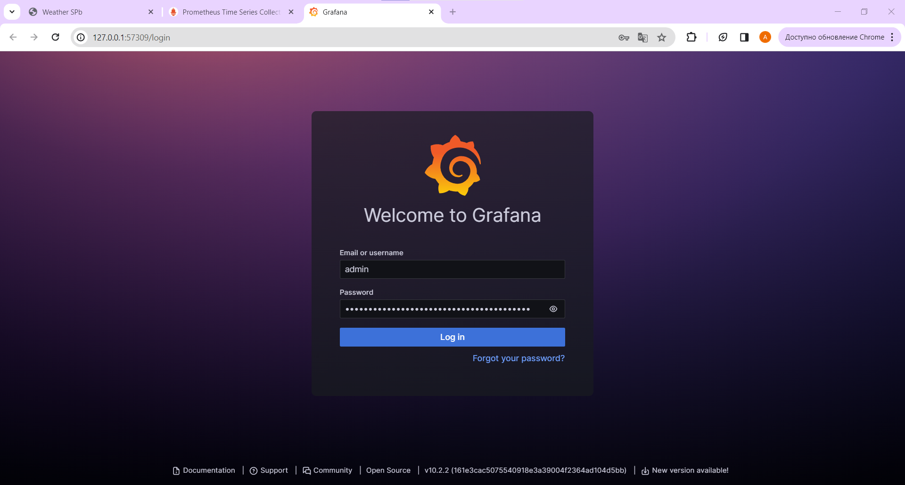
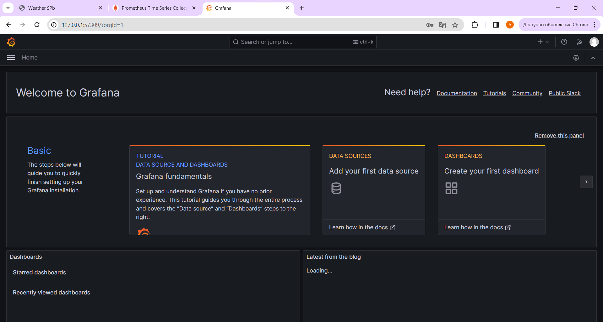
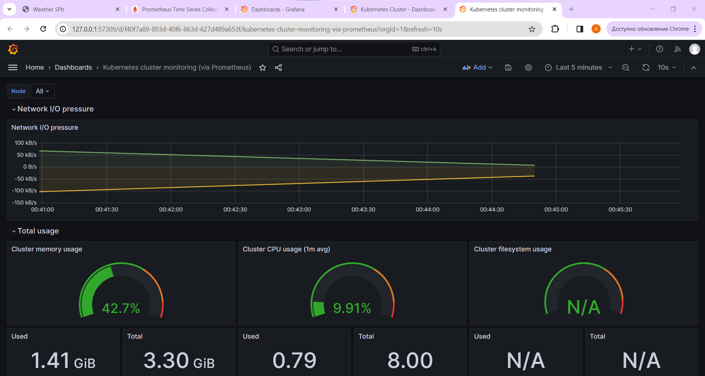

# Лабораторная работа №2 "Работа с Kubernetes"

## Выполнили:

Бевз Тимофей K34201, Загайнова Кристина K34201, Блохина Анастасия K34201, Балашов Матвей K34201

## Цель работы:

Сделать мониторинг сервиса, поднятого в Lab02, с использованием Prometheus и Grafana

## Задачи:

- Установить Prometheus и Grafana
- Настроить Prometheus и Grafana
- Продемонстрировать дашборд

## Ход работы

Для работы нам дополнительно потребуются:

- Chocolatey – для установки helm
- Helm – пакетный менеджер Kubernetes

### Установка Prometheus

Добавим репозиторий prometheus-community

> helm repo add prometheus-community https://prometheus-community.github.io/helm-charts

Из репозитория установим Prometheus и создадим NodePort сервис Kubernetes для Prometheus

> helm install prometheus prometheus-community/prometheus
> kubectl expose service prometheus-server --type=NodePort --target-port=9090 --name=prometheus-server-np

Для проверки команд можем просмотреть все поды, связанные с Prometheus

> kubectl get pods -l app.kubernetes.io/instance=prometheus
>   

Для доступа к интерфейсу выполним команду

> minikube service prometheus-server-np

В браузере откроется страничка
  

P.S. При установке нам сообщили, где работает Prometheus, потом это окажется полезным
  

### Установка Grafana

Как и в случае с Prometheus, добавим репозиторий, установим Grafana, запустим как сервис Kubernetes

> helm repo add grafana https://grafana.github.io/helm-charts
> helm install grafana grafana/grafana
> kubectl expose service grafana --type=NodePort --target-port=3000 --name=grafana-np

При установке нам выпала заметка, что для входа стоит использовать логин _admin_ и пароль, который можно получить, выполнив команду

> kubectl get secret --namespace default grafana -o jsonpath="{.data.admin-password}" | base64 --decode ; echo

На Windows утилита base64 не работает, но есть альтернатива - certutil

Мы записали пароль в файлик и затем его скопировали
  

Запускаем

> minikube service grafana-np

Открывается страничка, куда мы вводим полученные данные
  

Вход успешно выполнен
  

Осталось связать Grafana с Prometheus. Для этого зайдем в раздел _Connections > Datasources_ и укажем адрес, по которому работает Prometheus
  

### Работа с дашбордами

Выберем дашборд среди https://grafana.com/grafana/dashboards/ и укажем его ID при импорте (у нас 11454)

Вот так это все выглядит
  
